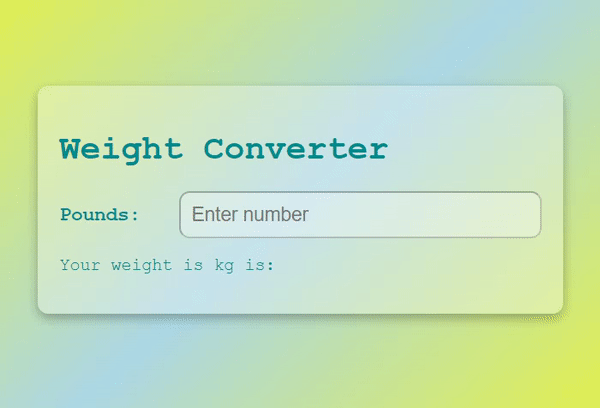

# Weight-Converter


## 기능
입력을 한 값을 kg으로 변환

## 학습 
### 1. JS : isNaN()    
- JavaScript에서는 NaN은 "Not-a-Number"의 약자  
- isNaN()값이 NaN이면 메서드는 true를 반환합니다 .
- isNaN()메서드는 테스트하기 전에 값을 숫자로 변환합니다.
```
isNaN( value )
```
> 매개변수 value : 검사할 값을 입력합니다.  
> 매개변수 value가 숫자가 아니면 true, 숫자이면 false를 반환합니다.

### 2. JS : clearTimeout()   
setTimeout()으로 생성한 타임아웃을 취소   
```
clearTimeout(errorTime);

// 2초 후에 errorEl와 inputEl을 공란으로 만들기
errorTime = setTimeout(() => {
  errorEl.innerText = "";
  inputEl.value = "";
}, 2000);
```
 
## 학습 출처
- 유튜브    
https://www.youtube.com/@JavaScriptKing 

- js    
https://www.codingfactory.net/10383   
https://www.w3schools.com/jsref/jsref_isnan.asp   
https://developer.mozilla.org/ko/docs/Web/API/clearTimeout    

- 키워드   
isNaN()   
clearTimeout()   
